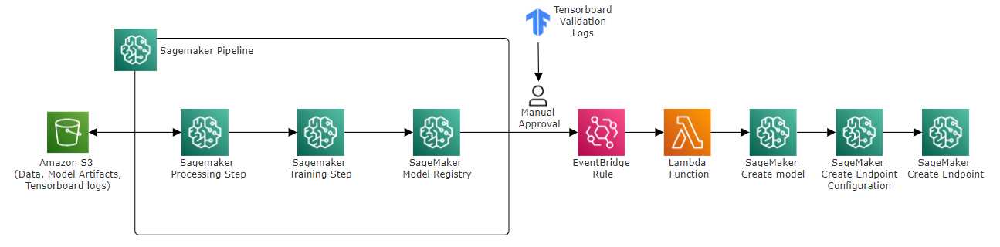

# Real ESRGAN | Finetune and deploy in AWS Sagemaker

<br>

## Overview
Real-ESRGAN is a model used for Super Resolution tasks, it was proposed in [Xintao Wang et al. 2021. PReal-ESRGAN: Training Real-World Blind Super-Resolution with Pure Synthetic Data](https://arxiv.org/abs/2107.10833) and implemented in [this repository](https://github.com/xinntao/Real-ESRGAN).


Here I present a particular implementation of a fine-tuning and deploying process using AWS Sagemaker, this includes a:
* SageMaker Pipeline that manages a:
    * Processing Job: in charge of creating the training set, using a High Quality set of images stored in S3
    * Training Job: training the model
    * Model register: create a package version with the trained model
* An AWS EventBridge rule
* An AWS Lambda Function
* Inference Endpoint creation: running an inference server in a sagemaker endpoint

<div style="text-align: center;">
    
    <h6>Proposed infrastructure</h6>
</div>

<br>

For this case, I've used the excellent work done in the official [model implementation](https://github.com/xinntao/Real-ESRGAN) and in the [Basiscr module](https://github.com/XPixelGroup/BasicSR) as the foundation. Several modifications have been applied to these modules:

* In the BasicSR module, I forked the repository and made minor adjustments, primarily related to the PATH where the logs are saved. This alteration enables TensorBoard to locate these logs during the execution of the SageMaker Training job.
* Regarding the Real-ESRGAN module, most of the changes are stored in this repository within the /script directories for each process. These modified scripts are copied inside the Dockerfile, replacing the original ones

<br>

## Sample result

This use case utilizes an scaling ratio of 1:4, where the image size is incremented in 4 times:
<div style="text-align: center;">
    
</div>

One might argue that this could be achieved with a single interpolation. However, upon zooming into the image, it becomes evident that incrementing the image size doesn't reduce its quality; instead, it enhances it


<br>

## Repository structure

* **setup.sh**: startup file, in charge of setting the needed infrastructure to run the full pipeline
* **build_and_push.sh**: this is an useful file to build and push images to ECR
* **infrastructure/**: in this DIR you will find the cloudformation + lambda code
* **preprocess/**: in this DIR you will find the processing job to preprocess the images before training
* **train/**: in this DIR you will find the training job
* **deploy/**: in this DIR you will find the necessary code to create a model with the trained model and deploying it into a sagemaker endpoint
* **pipeline/**: in this DIR you will find the implementation of the Sagemaker pipeline

<br>

## Pre-requirements

* Install docker
* Have a look in your AWS Quotas, you will need availability for:
    * Running a Preprocessing job in a ml.m5.large
    * Running a training job in a ml.g4dn.xlarge
    * Running an inference point in a ml.g4dn.xlarge
* For running the setup.sh file at least 8GB RAM are needed (due to images building)

## Usage

To use this repo you will need to:
1) Launch _setup.sh_ to build the needed infrastructure
```
chmod +x setup.sh
./setup.sh create
```

2) Add your training images into the bucket s3://realesrgan/train/hq and s3://realesrgan/validation/hq

3) Launch the Sagemaker pipeline that creates a new model version after training is completed
```
python3 pipeline/pipeline.py
```

<br>

## Cleanup

To tear down the used resources you can run the _teardown.sh_ file

```
chmod +x teardown.sh
./teardown.sh <SAGEMAKER_MODEL_NAME> <SAGEMAKER_ENDPOINT_CONFIGURATION_NAME>
```


