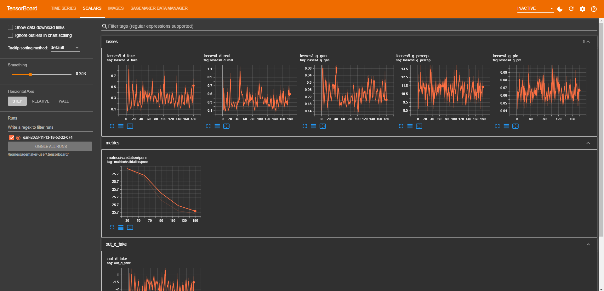

# Training job

 

## Overview

This phase encompasses several key steps:

Reading both the high-quality (HQ) and corresponding lower-quality (LQ) training and validation images previously processed and stored in S3.
Executing the training process, which involves logging and recording metrics while processing the validation images.
Concluding by storing the resulting model weights back into an S3 bucket.
It's important to note that this implementation is tailored specifically for x4 upscaling.

 

## Structure

* **Dockerfile**: the dockerfile for the training container
* **train**: sh commands to perform training
* **requirements.txt**: required libraries for training
* **scripts/**: DIR with the train.py file that will override the one used in the [Real-ESRGAN repo](https://github.com/xinntao/Real-ESRGAN/blob/master/realesrgan/train.py)
* **config/**: contains the configuration file that rules the whole training process

 

## Hints

* You can control almost any parameter from the config YAML file
* Always use an instance with a GPU enabled (ml.g4dn.xlarge will do fine)
* Open a sagemaker tensorboard session and keep an eye in the training metrics and validation images output

    

    

* Also keep an eye in the instance metrics while training (ensure the GPU is working correctly and detect any possible bottleneck)