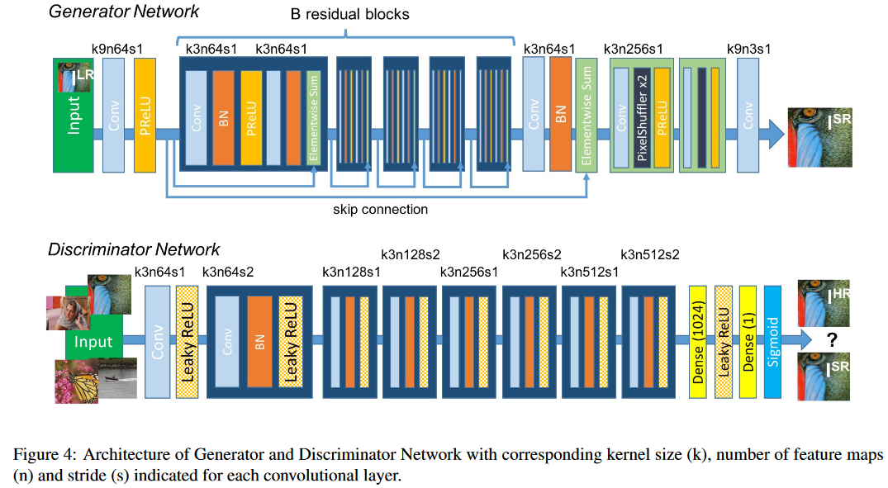

# SRGAN

This implementation from [Christian Ledig et al. 2016. Photo-Realistic Single Image Super-Resolution Using a Generative Adversarial Network. [https://arxiv.org/abs/1609.04802](https://arxiv.org/abs/1609.04802)] is engineered to use the [satellite-image-deep-learning/SODA-A](https://huggingface.co/datasets/satellite-image-deep-learning/SODA-A) dataset from Huggingface. So you can think of this to be an adaptation to the training and testing part from the paper. Nevertheless, models and loss function remain the same.

# Implemented infrastructure

*Generator and Discriminator infrastructure (Christian Ledig et al. 2016. Photo-Realistic Single Image Super-Resolution Using a Generative Adversarial Network)*